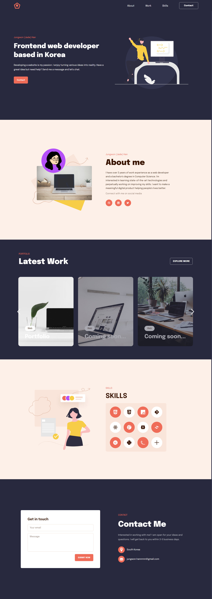

# Jungwon's Personal Portfolio website

## About The Project

I've been working as a frontend web developer over 3 years. I built my personal portfolio website to showcase technical skills. I turned laaqiq’s public design template into code.

It is responsive on all devices and has smooth animations. Check out my website [here](https://jwhan77.github.io/).

### Built with

- [React.js](https://reactjs.org/)

## Contact

Jungwon Han - [@hellojadev](https://twitter.com/hellojadev) - jungwon.hannnnn@gmail.com